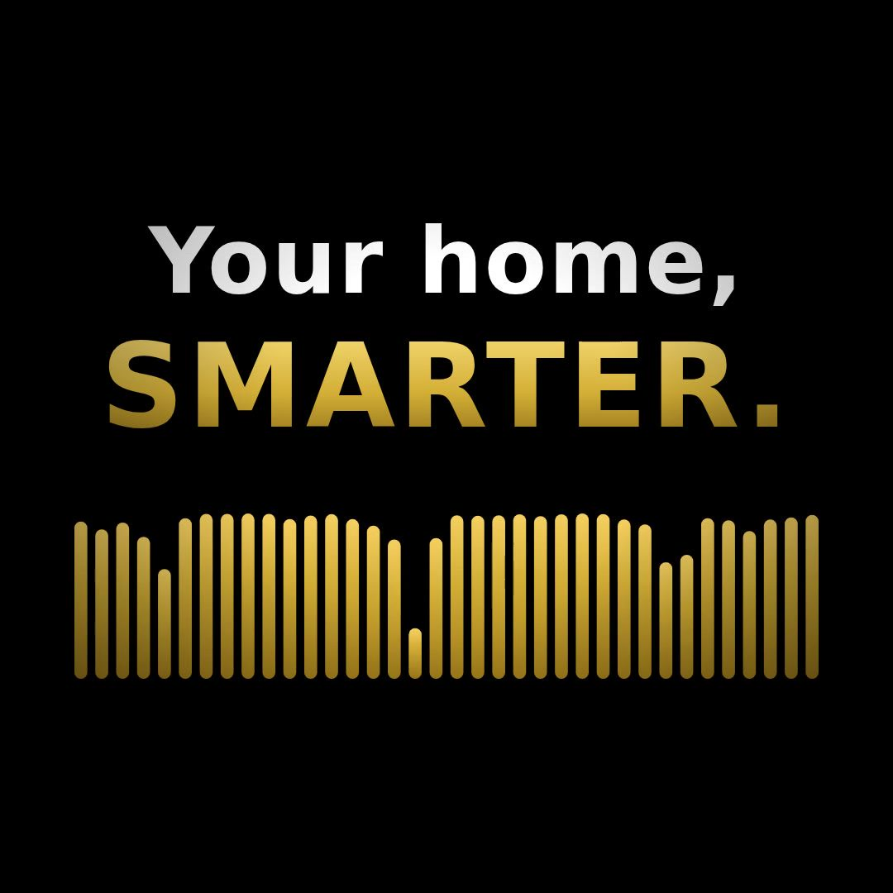

# Smart Alarm Solutions — Facebook Ad Video

A 15-second branded video ad built with Remotion.

## Preview

> The preview files below are auto-generated by GitHub Actions on every
> push that touches `video/`. If they don't exist yet, the first render
> hasn't finished — check the
> [Actions tab](https://github.com/SmartAlarm12/Claude-App--Github-Repo/actions)
> and refresh.




**Full-quality .mp4s** (click to play inline on GitHub):

- [smart-alarm-reels.mp4](preview/smart-alarm-reels.mp4) — 1080×1920, vertical (Reels / Stories)
- [smart-alarm-square.mp4](preview/smart-alarm-square.mp4) — 1080×1080, square (Feed)

## Compositions

- `SmartAlarmAd-Reels` — 1080×1920 (Instagram Reels, Facebook Stories)
- `SmartAlarmAd-Square` — 1080×1080 (Facebook Feed, Instagram Feed)

## Storyboard

| Time | Scene | Beat |
|------|-------|------|
| 0–2s | Logo reveal | Gold circuit-shield draws on, wordmark fades in over black, gold flash punctuates |
| 2–4s | Tagline | "Your home, SMARTER." with gold equalizer bars |
| 4–6s | ELAN Audio | Speaker icon, "Multi-room sound, every room, one app." |
| 6–8s | Home Theaters | Theater icon, "Cinema in your living room." |
| 8–10s | Smart Automation | House icon, "Lights, climate & security in one tap." |
| 10–15s | End card | Logo, ELAN Authorized · Locally Owned, phone, email, URL, gold "Book Free Consult" CTA |

## Brand palette

- Gold gradient: `#F5D061` → `#D4AF37` → `#A07C1B`
- Background: `#000000`
- Body text: `#F2F2F2` / `#FFFFFF`

Defined in `src/theme.ts`.

## Develop locally

```bash
cd video
npm install
npm run dev          # opens Remotion Studio at http://localhost:3000
```

## Render locally

```bash
npx remotion render SmartAlarmAd-Reels out/smart-alarm-reels.mp4
npx remotion render SmartAlarmAd-Square out/smart-alarm-square.mp4
```

## Notes

- All animations are driven by `useCurrentFrame()` per Remotion best
  practices (no CSS transitions).
- To swap in the real logo PNG once dropped at `public/logo.png`, replace
  `LogoShield` usage with ``.
- For voiceover, see `.claude/skills/remotion/skills/remotion/rules/voiceover.md`.
